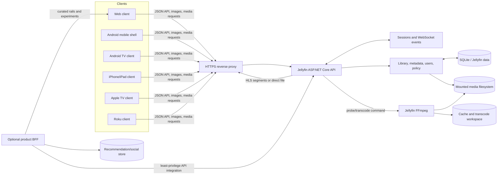
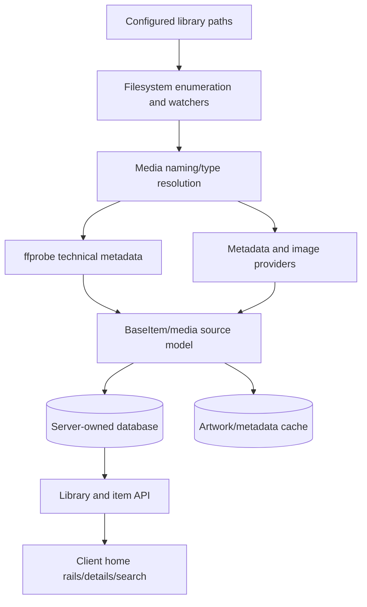
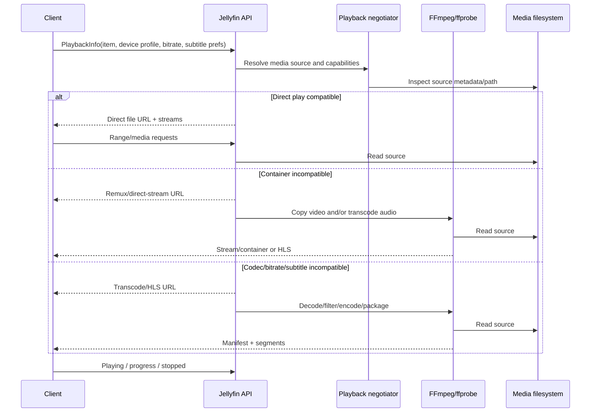
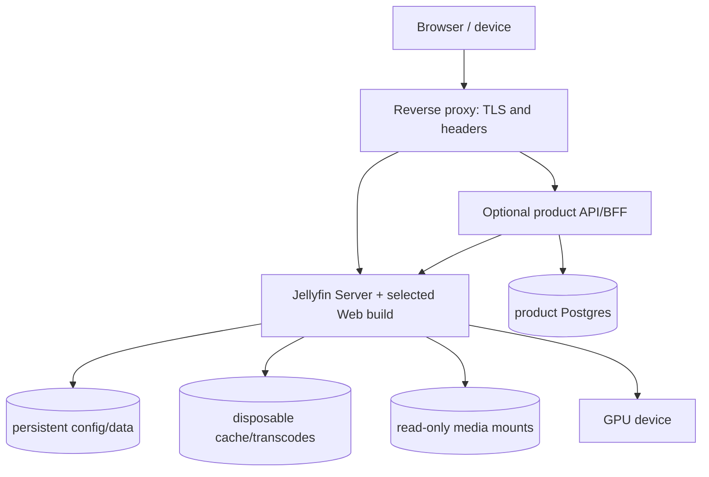
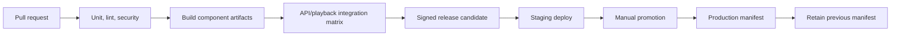

# Jellyfin-Based Streaming Platform: Technical Blueprint

**Status:** architecture and product plan only; no Jellyfin runtime code has been changed  
**Research baseline:** 2026-06-19  
**Target:** a self-hosted, open-source, Docker-first, premium streaming experience that keeps upstream Jellyfin upgrades practical

## 1. Executive decision

Use Jellyfin Server as the media, identity, library, session, and playback engine. Build a distinct product experience in independently versioned clients, initially by forking Jellyfin Web and the native TV clients. Extend the server through plugins and additive API services before changing server internals.

Do **not** develop the product inside `jellyfin-packaging`. That repository should remain a thin, reproducible release-orchestration layer. It pins and packages coordinated Server and Web revisions and produces OS packages, portable archives, and containers. Product code belongs in the relevant server, web, mobile, TV, Roku, or extension repository.

The recommended long-term shape is:

1. **Upstream-tracking forks** for Jellyfin Server and official clients.
2. **A product organization repository** for architecture decisions, design tokens, API contracts, Compose files, release manifests, and cross-repository automation.
3. **Plugins/additive services first** for recommendations, social features, watch parties, and product-specific aggregation.
4. **A stable product API/BFF boundary** between clients and experimental services.
5. **Periodic upstream merges**, not an early rewrite of the media engine.

> Repository preflight: the supplied working directory is a Standard Notes application checkout, not `jellyfin/jellyfin-packaging`. Therefore Phase 1 Jellyfin builds cannot honestly be executed in this checkout. The clone and build runbook below starts from a separate workspace and must be validated there before implementation begins.

## 2. Goals, constraints, and non-goals

### Goals

- Premium, dark-first discovery and playback UX across browser, mobile, and television.
- Self-hosted operation without a mandatory cloud dependency.
- Direct play whenever possible, with reliable remux/transcode fallback.
- Shared visual language while respecting each platform's input and playback conventions.
- Modular feature delivery and documented migration paths.
- Reproducible Docker development and GitHub-based release automation.

### Architectural constraints

- Jellyfin clients and server communicate over Jellyfin's HTTP API and WebSocket/session mechanisms.
- Client capability profiles affect whether playback is direct play, remux/direct stream, or transcode.
- Jellyfin expects media files to be visible on a filesystem; network media should be mounted by the host.
- The operational database/configuration must be persistent and kept on reliable local storage, not an unreliable network mount.
- Subtitle choice can change the playback method; image/complex subtitles often require video burn-in.
- Platform app-store signing, entitlements, privacy declarations, and release pipelines remain platform-specific.

### Non-goals for the first release

- Replacing FFmpeg.
- Replacing the Jellyfin library scanner, metadata model, or playback decision engine.
- Creating a second source of truth for users, watch state, or media metadata.
- Supporting DRM-protected commercial catalogs.
- Building every client simultaneously.
- Making an upstream-incompatible server fork merely to rename visible UI.

## 3. Ecosystem repository map

| Repository                             | Role and technology                                                                                                                                                                   | Communicates through                                                                          | Product recommendation                                                                                                   |
| -------------------------------------- | ------------------------------------------------------------------------------------------------------------------------------------------------------------------------------------- | --------------------------------------------------------------------------------------------- | ------------------------------------------------------------------------------------------------------------------------ |
| `jellyfin/jellyfin`                    | ASP.NET Core/.NET server, API controllers, library and metadata services, user/session policy, playback negotiation, transcoding orchestration, scheduled tasks, plugins, persistence | HTTP/JSON API, WebSockets/session events, media endpoints, filesystem, FFmpeg child processes | Track closely. Modify only for capabilities impossible through plugins/additive services.                                |
| `jellyfin/jellyfin-web`                | TypeScript/JavaScript web client and reusable web experience; also forms the UI used by wrapper-style clients                                                                         | Jellyfin API, browser media APIs, HLS playback, server WebSocket/session messages             | Primary Phase 2–3 fork for branding and browser UI.                                                                      |
| `jellyfin/jellyfin-android`            | Kotlin Android shell integrating the official web client plus native Android facilities and playback choices                                                                          | Embeds/loads web client; Kotlin SDK/API calls; Android media, cast, and lifecycle APIs        | Rebrand shell early; defer a fully native rewrite until product/API behavior stabilizes.                                 |
| `jellyfin/jellyfin-androidtv`          | Native Kotlin/Java TV client for Android TV, Google TV, Shield, and Fire TV                                                                                                           | Kotlin SDK/API, native TV UI, native player stack, session reporting                          | Primary TV fork. Redesign focus/navigation separately from Web.                                                          |
| `jellyfin/jellyfin-roku`               | Roku SceneGraph/BrightScript client and Roku-native playback                                                                                                                          | Jellyfin HTTP API, Roku video/player APIs                                                     | Separate TV implementation. Share tokens/specifications, not UI code.                                                    |
| `jellyfin/Swiftfin`                    | Native Swift client for Apple platforms; practical starting point for iPhone/iPad/Apple TV planning                                                                                   | Swift API model/client, AVFoundation/AVPlayer or native playback layer                        | Evaluate and fork for Apple clients; verify current platform coverage and release readiness during Phase 4 discovery.    |
| `jellyfin/jellyfin-packaging`          | Server/Web packaging and release workflows; submodules/pins Server and Web; builds packages, archives, and Docker images                                                              | Git submodules/source revisions, Docker, distro package tooling, GitHub Actions               | Keep thin. Change names, package metadata, image coordinates, and release composition only after product artifacts work. |
| `jellyfin/jellyfin-ffmpeg`             | Jellyfin-maintained FFmpeg build/patch/package source used for broad codec and hardware support                                                                                       | Invoked as an external process by Server                                                      | Leave untouched unless a measured codec/hardware defect requires a patch.                                                |
| `jellyfin/jellyfin-sdk-kotlin`         | Generated/maintained Kotlin API models and client infrastructure                                                                                                                      | OpenAPI-derived server contract                                                               | Consume from Android clients; avoid hand-editing generated models.                                                       |
| `jellyfin/jellyfin-sdk-typescript`     | TypeScript SDK/API types and client support                                                                                                                                           | OpenAPI-derived server contract                                                               | Prefer in custom web/BFF integrations where appropriate.                                                                 |
| Server OpenAPI document                | Machine-readable API contract exposed/generated by Server                                                                                                                             | Generates SDKs and documents endpoints                                                        | Treat as the compatibility contract; version product-specific APIs separately.                                           |
| Jellyfin plugins                       | In-process server extensions for metadata, scheduled tasks, notifications, and selected APIs/UI configuration                                                                         | Server plugin interfaces and dependency injection                                             | First choice for bounded server extensions, with strict version-compatibility testing.                                   |
| Product BFF/service (new)              | Optional independently deployed service for recommendations, social graphs, presence, experiments, and home-feed aggregation                                                          | Jellyfin API/service account or user delegation, product API, event ingestion                 | Add after core UX prototype. Never proxy video bytes unless there is a proven need.                                      |
| Product control-plane repository (new) | Compose, ADRs, design tokens, schemas, release manifest, docs, integration tests                                                                                                      | Pins all product component versions                                                           | Create first; this becomes the program's coordination point.                                                             |

### Important repository correction

The legacy Roku repository was archived in 2025; current work belongs in `jellyfin/jellyfin-roku`. Clone only the active repository. Similarly, validate active Apple client repositories at Phase 4 kickoff rather than assuming an archived client is production-ready.

## 4. How the pieces communicate



### Typical authenticated request

1. A client discovers/selects a server and identifies its client name, version, device, and device ID.
2. Credentials or Quick Connect produce a server-managed access token.
3. The client stores the token in platform-appropriate secure storage and sends it on subsequent API requests.
4. Server authentication resolves the token/device session; authorization evaluates administrator status, user policy, library access, remote access, playback/transcode/download permissions, and endpoint requirements.
5. Session/playback progress is reported back to the server so resume state, active sessions, and remote control remain coherent.

Never create a parallel password database. Social profiles should reference Jellyfin user IDs and maintain only product-specific profile fields. External identity/SSO work is security-sensitive and requires a dedicated threat model.

## 5. Server architecture

### Logical layers

- **Host/API:** ASP.NET Core startup, routing, middleware, controllers, authentication, authorization, OpenAPI, health and network behavior.
- **Application/domain contracts:** media entities, library contracts, sessions, users, providers, encoding abstractions, plugin contracts.
- **Implementations:** library scans, metadata refresh, repositories, scheduled tasks, users, sessions, activity, trickplay, and concrete services.
- **Persistence:** SQLite-backed Jellyfin data plus configuration, metadata, images, logs, cache, and transcode files under separate operational paths.
- **External workers:** `ffprobe` inspects streams; `ffmpeg` remuxes/transcodes/packages output.

### Database architecture

Jellyfin is designed around embedded SQLite persistence. Current server development has been migrating legacy library/user-data persistence toward Entity Framework Core-backed contexts and migrations. Treat the database schema as server-owned:

- Do not query or mutate tables directly from product services.
- Use public API/plugin abstractions.
- Back up configuration and data before server upgrades.
- Keep database storage local, persistent, and low-latency.
- Do not assume horizontal active-active Server replicas can share one SQLite database.
- For scale, first separate stateless recommendation/social services; retain one authoritative Jellyfin Server per library domain unless upstream adds supported clustering.

### Media library architecture



Libraries are views over mounted media plus server metadata, not uploaded object storage. File naming and availability directly affect scan results. Collections, playlists, favorites, play state, ratings, and user data should continue to use upstream capabilities where they satisfy the product requirement.

### Users and permissions

Model authorization as server-enforced policy, never as hidden client controls. Important policy dimensions include:

- administrator privilege;
- enabled/disabled account and login constraints;
- library and item access;
- parental rating/tag restrictions;
- local versus remote access;
- media playback permission;
- audio/video transcoding and container conversion permission;
- download permission;
- Live TV/channel/recording permission;
- shared-device/session limits and remote-control behavior.

Every new endpoint needs explicit authorization, ownership checks, audit behavior, rate limits where appropriate, and tests proving one user cannot read or mutate another user's data.

## 6. Playback, streaming, FFmpeg, and subtitles



### Playback modes

- **Direct Play:** original bytes/streams; lowest server cost and highest quality.
- **Remux:** changes container while copying audio/video.
- **Direct Stream:** commonly preserves video while transcoding an incompatible audio stream.
- **Transcode:** decodes and re-encodes video and possibly audio; may tone-map or burn subtitles.

The client supplies a device profile/capability description and playback constraints. Server negotiation chooses a source and delivery mode. This is why each native client must maintain accurate codec/container/audio/subtitle capabilities.

### HLS and DASH

HLS is a central adaptive/transcode delivery path in Jellyfin, with manifests and transport-stream or fragmented-MP4 segments depending on server/client choices. Direct file and other stream endpoints also exist. Do not make DASH a Phase 1 assumption: verify the current server/client path and target-device need before committing to DASH as a product requirement. The product should expose playback intent/capability and let the server select supported delivery rather than hard-code HLS URLs in UI code.

### FFmpeg integration

- Server generates and supervises FFmpeg commands.
- `ffprobe` supplies technical stream metadata.
- Transcode output is written to a cache/transcode path and served while generated.
- Hardware acceleration may use Intel QSV/VA-API, NVIDIA NVENC/NVDEC, AMD VA-API/AMF, Apple VideoToolbox, or supported SoC paths.
- GPU access must be passed into the container and verified with a real transcode, not merely configured.
- Preserve Jellyfin's FFmpeg distribution initially; upstream patches and build options are part of compatibility.

### Subtitle architecture

Subtitles may be:

- embedded text tracks;
- embedded bitmap/image tracks;
- external sidecar files;
- fetched by subtitle-provider plugins;
- delivered separately, remuxed, converted, or burned into video.

Burn-in invokes video transcoding and is frequently the most expensive path. UI must show selected language/forced/SDH status clearly, preserve user preferences, and report why transcoding occurs. Test SRT, WebVTT, ASS/SSA styling, PGS, VobSub, forced tracks, RTL text, font attachments, offset, and multi-language defaults.

## 7. Modification matrix

| Change                                                             | Required repositories                                               | Avoid changing                       |
| ------------------------------------------------------------------ | ------------------------------------------------------------------- | ------------------------------------ |
| Browser logo, colors, typography, app name, splash, icons          | `jellyfin-web`; later packaging metadata                            | Server domain logic, FFmpeg          |
| Android mobile launcher/name/splash                                | `jellyfin-android`; web assets if embedded UI remains               | Server                               |
| Android TV branding and TV navigation                              | `jellyfin-androidtv`                                                | Web-only CSS assumptions             |
| Roku branding/navigation                                           | `jellyfin-roku`                                                     | Packaging                            |
| Apple branding/native UX                                           | `Swiftfin` or selected active Apple client fork                     | Web unless using web UI              |
| Netflix-style browser home and details                             | `jellyfin-web`; optional BFF/plugin for curated rails               | Packaging                            |
| New cross-client server capability                                 | Plugin first; then `jellyfin` plus OpenAPI/SDK updates if necessary | Per-client duplicated business rules |
| Recommendations/social/watch-party data                            | New service/plugin plus clients                                     | Direct Jellyfin DB writes            |
| Package name, container image, distro service, release composition | `jellyfin-packaging` after artifacts exist                          | UI repositories                      |
| Codec/hardware fix                                                 | Server command generation or `jellyfin-ffmpeg`, only with evidence  | Branding layers                      |

### Repositories that should usually remain untouched

- `jellyfin-ffmpeg`, until a reproducible codec or hardware-acceleration defect proves a patch is necessary.
- Generated SDK model code; regenerate it from a reviewed API contract.
- Jellyfin database schema/migrations for product-only data.
- Packaging during UI prototyping.
- Upstream server authentication, library scanner, and playback core during branding/UI phases.

## 8. Branding strategy

### Legal and identity gate

Before publishing:

1. Choose an original name and run trademark/domain/app-store searches.
2. Review every dependency's license and attribution obligations.
3. Remove Jellyfin trademarks and artwork from product-facing assets without obscuring required copyright/license notices.
4. Document fork source, modifications, corresponding source availability, notices, and redistribution process.
5. Obtain legal review before public distribution; this blueprint is not legal advice.

### Design system

Create a platform-neutral token package/specification:

- **Color:** near-black layered surfaces, restrained accent, semantic success/warning/error, accessible focus ring.
- **Typography:** display, title, body, metadata, and TV scale; avoid tiny low-contrast metadata.
- **Spacing:** 4/8-based scale with larger TV density.
- **Shape:** modest radius, consistent cards, glass only where legibility and GPU cost are acceptable.
- **Motion:** 120–250 ms navigation transitions, reduced-motion alternatives, no layout-shifting flourish.
- **Artwork:** backdrop, poster, logo, thumbnail, avatar aspect ratios and safe areas.
- **Focus:** visible, high-contrast, spatially predictable TV focus with scroll anchoring.

Do not copy Netflix, Apple, Disney, or Plex assets or distinctive trade dress. Interpret the qualities—cinematic imagery, restraint, hierarchy, responsive motion—not their exact layouts.

### Branding implementation order

1. Inventory every visible string, icon, logo, package ID, URL, color, splash, notification, and store asset.
2. Introduce tokens/configuration before mass replacements.
3. Rebrand Web as the reference visual language.
4. Rebrand each native shell with native assets and identifiers.
5. Rename packages/images/services last, with migration and rollback documentation.
6. Add automated scans for forbidden legacy marks, while allowing license notices and technical compatibility identifiers where removal would break protocol.

## 9. UX blueprint

### Information architecture

- Home
- Search
- Movies
- Series
- Live (if enabled)
- Collections
- My List/Favorites
- Downloads (supported clients only)
- Profile and Settings

### Home composition

1. Hero with one primary action, one secondary action, readable gradient/scrim, and optional muted preview.
2. Continue Watching.
3. Next Up.
4. Personalized recommendations.
5. Recently Added.
6. Trending **on this server** (define transparent ranking window).
7. Genre/category rails.
8. Curated collections.

Do not label a simple “recently played” list as AI. Every rail requires a documented source, ranking, empty state, privacy behavior, and fallback.

### TV interaction requirements

- All actions reachable by D-pad, Back, Select, and media keys.
- Stable focus after returning from details/playback.
- No hover-only controls.
- Overscan-safe padding and large hit/focus targets.
- Virtualized rails and artwork prefetch limits.
- Search optimized for remote/voice input.
- Playback starts with minimal modal friction.

### Performance budgets

Define and measure:

- home usable time on representative low-end TV hardware;
- API request count and payload size for initial home;
- image bytes and memory cache ceiling;
- rail scrolling frame time;
- input-to-focus latency;
- playback start time by direct play/remux/transcode;
- crash-free sessions and transcode failure rate.

## 10. Recommended clone list

### Clone now

```text
platform-control-plane        # new: docs, ADRs, Compose, release manifest, integration tests
jellyfin                      # upstream remote + product fork
jellyfin-web                  # upstream remote + product fork
jellyfin-packaging            # upstream remote + product fork; release work only
```

### Clone when the corresponding workstream starts

```text
jellyfin-android
jellyfin-androidtv
jellyfin-roku
Swiftfin
jellyfin-sdk-kotlin
jellyfin-sdk-typescript
```

### Reference but do not fork initially

```text
jellyfin-ffmpeg
jellyfin-plugin-template
jellyfin-meta-plugins / selected official plugins
```

Use two remotes in every fork:

```bash
git remote rename origin upstream
git remote add origin git@github.com:YOUR_ORG/REPOSITORY.git
git fetch --all --tags
```

Pin known-good component SHAs in a release manifest. Never build production from floating `master`.

## 11. Local development environment

### Recommended workstation

- Linux x86_64 (current Ubuntu LTS or Debian stable) for packaging parity.
- 8 modern CPU cores, 32 GB RAM, 100+ GB free NVMe workspace.
- Docker Engine with Compose plugin.
- Git, Git LFS if required, Python 3 plus packaging-script dependencies.
- Current .NET SDK required by the checked-out Server branch.
- Node.js/package-manager versions required by the checked-out Web branch.
- Android Studio, compatible JDK, Android SDK/emulators for Android work.
- macOS/Xcode and Apple developer tooling for signed Apple builds.
- Roku developer-mode device for Roku validation.
- Optional Intel/NVIDIA/AMD GPU with container device access.

Use version managers/devcontainers and repository lockfiles as authority. Exact versions are branch-dependent and must be captured in the Phase 1 build record rather than frozen from this planning document.

### Workspace layout

```text
streaming-platform/
├── control-plane/
├── server/
├── web/
├── packaging/
├── android/
├── androidtv/
├── roku/
├── apple/
├── media-samples/       # licensed/synthetic fixtures only
└── runtime/             # ignored config/cache; no secrets in Git
```

## 12. Phase 1 build runbook

### Preflight

```bash
git --version
docker version
docker compose version
python3 --version
dotnet --info
node --version
```

Record all outputs in a dated build report. Check each repository's README and workflow files at the pinned revision because toolchain requirements change.

### Packaging repository

Official packaging flow is Docker-oriented on amd64 Linux:

```bash
git clone https://github.com/jellyfin/jellyfin-packaging.git
cd jellyfin-packaging
git submodule update --init
./checkout.py master
./build.py --help
```

Then run the specific `build.py` target selected from the repository's current help/README. For a release baseline, replace `master` with a coordinated stable tag and retain the resulting source SHAs, command, logs, artifact hashes, and image digest. Do not guess build arguments across packaging revisions.

### Server development

```bash
git clone https://github.com/jellyfin/jellyfin.git
cd jellyfin
dotnet restore Jellyfin.sln
dotnet build Jellyfin.sln
dotnet test Jellyfin.sln
```

Run instructions and SDK versions must be verified from that revision's README/workflows. Use isolated config, cache, log, and data paths and a disposable media library.

### Web development

```bash
git clone https://github.com/jellyfin/jellyfin-web.git
cd jellyfin-web
```

Use the package manager and scripts declared by the checked-out branch. Run its install, lint, test, and development-server commands exactly as documented. Point the dev client at the disposable Server instance; never test against the only copy of a personal library.

### Android clients

```bash
git clone https://github.com/jellyfin/jellyfin-android.git
cd jellyfin-android
./gradlew assembleDebug
./gradlew installDebug

git clone https://github.com/jellyfin/jellyfin-androidtv.git
cd jellyfin-androidtv
./gradlew assembleDebug
```

The mobile app currently integrates the web client, whereas Android TV is a separate native TV experience. A Web redesign does not automatically redesign Android TV.

### Acceptance record for every build

- repository URL, branch, tag, and SHA;
- host OS/architecture;
- toolchain versions;
- exact commands and duration;
- test results;
- produced artifact path, size, and SHA-256;
- container image digest and SBOM if produced;
- known warnings;
- smoke-test result against a fixed media matrix.

## 13. Recommended Docker environment



### Compose principles

- Pin image digests for release environments.
- Mount media read-only unless recording/management explicitly requires writes.
- Keep config/data persistent; make cache/transcodes a separate volume.
- Never publish Jellyfin's port directly on an untrusted network; terminate TLS at a reviewed reverse proxy.
- Pass GPU devices/groups explicitly and test hardware transcoding.
- Add health checks, resource monitoring, log rotation, backups, and restore drills.
- Keep product service secrets in a secret manager or untracked environment file.
- Do not put Jellyfin's SQLite database on NFS/SMB.
- Use profiles for CPU-only, Intel, NVIDIA, and AMD development rather than one privileged container.

### Environment tiers

- **dev:** synthetic media, debug clients, local TLS optional, disposable data.
- **integration:** fixed codec/subtitle library, seeded users/policies, browser/device automation.
- **staging:** production-like reverse proxy, GPU, backup/restore, signed candidate apps.
- **production:** immutable pinned artifacts, monitored storage, tested rollback.

## 14. CI/CD design

### Per-repository pipelines

- Format/lint/unit tests.
- Dependency and secret scanning.
- Build signed/unsigned artifacts as appropriate.
- Generate SBOM and provenance.
- Upload immutable artifacts keyed by commit SHA.
- Contract test against supported Server versions.

### Control-plane release pipeline



Use a compatibility matrix, for example:

| Product client |       Minimum Server |   Recommended Server | Tested latest Server |
| -------------- | -------------------: | -------------------: | -------------------: |
| Web            | recorded per release | recorded per release |            CI result |
| Android        | recorded per release | recorded per release |            CI result |
| Android TV     | recorded per release | recorded per release |            CI result |
| Roku           | recorded per release | recorded per release |            CI result |
| Apple          | recorded per release | recorded per release |            CI result |

CI should test API schema drift, login, browse, search, playback-info negotiation, progress updates, subtitles, and direct play/remux/transcode fixtures.

## 15. Development roadmap

### Phase 0 — Governance and baselines (week 1)

- Create control-plane repository, ADR template, changelog policy, threat-model template, and release manifest.
- Select an upstream stable release and record all SHAs/licenses.
- Establish product name as a placeholder until legal clearance.
- Build a licensed/synthetic media compatibility corpus.
- Define measurable UX and playback success metrics.

**Exit:** clean baseline builds are reproducible; no branding code has begun.

### Phase 1 — Build and operating baseline (weeks 1–3)

- Build Server, Web, and packaging artifacts.
- Run Docker development stack.
- Verify direct play, remux, software transcode, hardware transcode, subtitles, trickplay, and resume state.
- Document setup, reset, backup, restore, upgrade, and rollback.
- Capture CI parity and known upstream issues.

**Exit:** another developer can reproduce every artifact from the runbook.

### Phase 2 — Branding foundation (weeks 4–6)

- Approve name, logo system, typography, colors, iconography, motion, and accessibility tokens.
- Rebrand Web and native shells without changing core behavior.
- Add legacy-brand inventory checks.
- Update package IDs and distribution metadata only with migration plans.

**Risk:** package/application identifier changes can break upgrades, saved credentials, deep links, signing, and store identity.

**Exit:** branded builds pass functional parity and attribution review.

### Phase 3 — Premium discovery UX (weeks 7–14)

- Build the Web reference experience: hero, rails, details, search, profiles, responsive navigation.
- Use existing endpoints first; introduce a home-feed BFF only when request fan-out/ranking proves necessary.
- Prototype TV focus behavior before porting visual concepts.
- Add performance telemetry that remains local/self-hosted by default.

**Exit:** responsive Web release meets accessibility/performance budgets and does not regress playback.

### Phase 4 — Native application program (months 4–9)

- Android: decide enhanced wrapper versus native UI based on measured limitations.
- Android TV: implement native design system and focus/navigation.
- Apple: validate Swiftfin or selected fork, then target iPhone/iPad and tvOS.
- Roku: implement SceneGraph-native UI and playback profiles.
- Maintain shared API contracts, token names, artwork policy, analytics events, and acceptance tests.

**Exit:** each app passes platform playback matrix, accessibility, signing, update, and store-review readiness.

### Phase 5 — Advanced capabilities (months 7–15)

Implement behind feature flags and in this order:

1. transparent non-AI recommendations (genre, recency, co-watch);
2. personalized home feed;
3. user ratings and enhanced collections;
4. voice search via native platform APIs;
5. watch-party synchronization and presence;
6. profile/social graph and privacy controls;
7. offline downloads with encryption, quota, expiry, revocation, and rights model;
8. ML recommendations after event quality, consent, explainability, and fallback behavior are proven.

**Exit:** features have privacy controls, data retention, abuse controls, cross-client contracts, migration, and rollback.

### Phase 6 — Independent product identity (month 12+)

- Remove remaining accidental visual coupling.
- Stabilize product-specific APIs and migration tooling.
- Decide which server divergences justify permanent maintenance.
- Keep protocol compatibility where useful and legally/technically appropriate.
- Publish source, notices, releases, security process, and upgrade policy.

“Independent” should mean product identity and roadmap—not an unnecessary rewrite of mature media infrastructure.

## 16. Advanced-feature architecture notes

### Recommendations

Start with explainable batch/online ranking using watch history, completion, recency, genres, people, favorites, and explicit ratings. Store derived features outside Jellyfin. Fetch Jellyfin metadata by stable item ID and tolerate deleted/replaced items. Provide “Because you watched…” explanations and opt-out/reset.

### Voice search

Use OS speech APIs where available, convert speech to text on-device when practical, and send only the resulting query to normal search. Avoid deploying always-listening microphones or storing audio by default.

### Watch parties

Use a room service with WebSockets, host authority, monotonic sequence numbers, media/item identity, periodic position correction, and authorization that verifies every participant can access the item. The service coordinates playback state; media still streams directly from Jellyfin.

### Offline downloads

This is not simply exposing the server Download endpoint. It needs per-user/device authorization, secure local storage, key lifecycle, manifest integrity, subtitles/audio selection, partial-download recovery, quota/eviction, background constraints, server policy, and logout/revocation behavior.

### Social profiles

Keep private by default. Separate Jellyfin identity from optional display name/avatar/follow data. Add blocking, visibility controls, deletion/export, moderation boundaries, and no exposure of watch history without explicit consent.

## 17. Risk register

| Risk                                 | Impact                                     | Mitigation                                                                             |
| ------------------------------------ | ------------------------------------------ | -------------------------------------------------------------------------------------- |
| Long-lived forks drift from upstream | Security and upgrade burden                | Thin patches, upstream remotes, monthly merge rehearsal, ADR for every core divergence |
| Branding changes break upgrades      | Lost settings/credentials/store continuity | Delay identifiers; migration tests; signed rollback                                    |
| Home UI creates API fan-out          | Slow TVs and server load                   | Aggregate only after profiling; cache scoped by user/policy                            |
| Incorrect client codec profiles      | Needless transcoding or playback failure   | Device playback matrix and telemetry explaining decisions                              |
| Subtitle burn-in overload            | High CPU/GPU, poor start time              | Prefer compatible text delivery; test fonts/formats; capacity alerts                   |
| Direct DB integration                | Corruption and upgrade breakage            | API/plugin abstractions only                                                           |
| SQLite/network storage               | Locks/corruption/latency                   | Local persistent storage, backups, restore drills                                      |
| AI feature privacy                   | Loss of trust                              | Local-first processing, consent, retention limits, explainability                      |
| Watch-party authorization gap        | Unauthorized media metadata/access         | Recheck access per participant and room lifecycle                                      |
| Multi-platform scope explosion       | Delayed product                            | Web reference first, Android TV second, explicit platform gates                        |
| Copied competitor trade dress        | Legal/product identity risk                | Original tokens/layouts/assets and legal review                                        |
| Packaging used as source monorepo    | Brittle releases                           | Keep product work in component repos and pin artifacts                                 |

## 18. First-week implementation plan

### Day 1 — Workspace and governance

- Verify the actual repositories and upstream remotes.
- Create the control-plane skeleton, `docs/adr`, `docs/runbooks`, `release-manifest`, and changelog template.
- Record host/tool versions and storage/GPU topology.
- Select a stable upstream baseline; do not use floating branches for the milestone.

### Day 2 — Server baseline

- Build and test Server unchanged.
- Run with isolated disposable paths.
- Seed two ordinary users and one administrator with differing library/transcode/download policies.
- Import the legal media fixture set and record scan behavior.

### Day 3 — Web and playback baseline

- Build Web unchanged and connect it to the disposable server.
- Test login, browse, search, play, seek, resume, subtitles, and logout.
- Capture browser network waterfalls and playback decision logs.

### Day 4 — Packaging and Docker

- Initialize packaging submodules and build one supported artifact and one Docker image.
- Record hashes/digests, SBOM, and reproducibility differences.
- Validate persistent config, read-only media, separate cache, restart, backup, and restore.

### Day 5 — Product architecture review

- Approve repository ownership and modification matrix.
- Review design-system brief and original-brand legal checklist.
- Triage playback matrix gaps.
- Create Phase 2 impact proposal; make no branding code changes until approved.

### Week-one deliverables

- Reproducible build report with exact SHAs and commands.
- Docker development runbook.
- Playback compatibility report.
- Repository ownership/CODEOWNERS proposal.
- Initial ADRs: fork strategy, server-extension strategy, product BFF decision threshold, identity boundary.
- Phase 2 branding impact plan and rollback strategy.

## 19. Change-control policy

Every implementation pull request must include:

1. **Intent and user outcome.**
2. **Affected repositories/components.**
3. **Architecture and upgrade impact.**
4. **Security/privacy impact.**
5. **Playback/performance impact.**
6. **Data/config migration and rollback.**
7. **Tests and device/media matrix evidence.**
8. **CHANGELOG entry.**

Core Server, authentication, authorization, database, scanner, and transcoding changes require an ADR and risk review before code. Prefer a plugin, BFF, configuration layer, or client-only solution when it satisfies the requirement.

## 20. Definition of done

A phase is complete only when:

- source revisions and dependencies are pinned;
- builds and tests are reproducible in CI;
- accessibility and TV remote behavior are tested;
- direct play/remux/transcode/subtitle scenarios pass;
- backup, migration, upgrade, and rollback are documented;
- security/privacy review is complete;
- changelog and notices are current;
- performance budgets are measured, not assumed;
- a clean upstream merge rehearsal has been performed for modified Jellyfin forks.

## 21. Official sources and verification checklist

This blueprint was based on official Jellyfin project repositories and documentation available on 2026-06-19:

- Jellyfin organization: <https://github.com/jellyfin>
- Server: <https://github.com/jellyfin/jellyfin>
- Web: <https://github.com/jellyfin/jellyfin-web>
- Android: <https://github.com/jellyfin/jellyfin-android>
- Android TV: <https://github.com/jellyfin/jellyfin-androidtv>
- Roku: <https://github.com/jellyfin/jellyfin-roku>
- Packaging: <https://github.com/jellyfin/jellyfin-packaging>
- Swiftfin: <https://github.com/jellyfin/Swiftfin>
- Documentation: <https://jellyfin.org/docs/>
- Storage: <https://jellyfin.org/docs/general/administration/storage/>
- Transcoding: <https://jellyfin.org/docs/general/post-install/transcoding/>
- Hardware acceleration: <https://jellyfin.org/docs/general/post-install/transcoding/hardware-acceleration/>
- Codec/client support: <https://jellyfin.org/docs/general/clients/codec-support/>

Before implementation, verify at the selected SHAs:

- current default/stable branches and latest coordinated release;
- required .NET, Node, JDK, Android SDK, Python, and Docker versions;
- exact build scripts and GitHub Actions workflows;
- OpenAPI and SDK compatibility;
- active Apple-platform client scope;
- current package/image naming and submodule behavior;
- licenses, notices, and redistribution requirements.

Online repository inspection was possible for this plan, but direct Git cloning from GitHub was blocked by the execution environment's HTTP CONNECT policy. Therefore source-level assertions must be reconfirmed against the locally cloned Jellyfin repositories during Phase 1.
