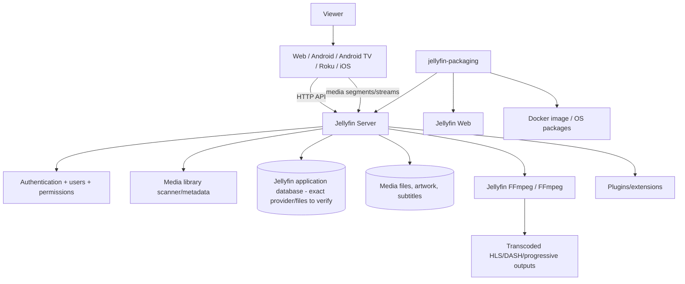
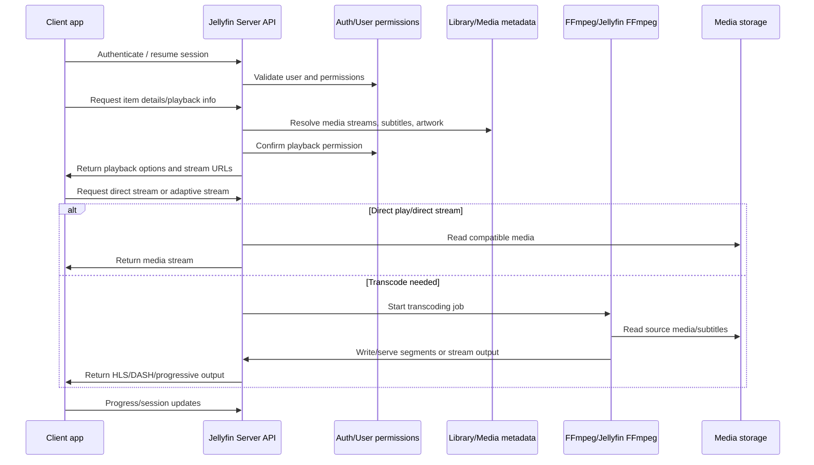

# Jellyfin-Based Streaming Platform Technical Blueprint

> Status: analysis-only planning document. No Jellyfin product code has been changed.
>
> Verification note: this repository checkout is **Standard Notes**, not `jellyfin-packaging`. The requested Jellyfin repository could not be cloned from this container because `git clone https://github.com/jellyfin/jellyfin-packaging.git` returned `CONNECT tunnel failed, response 403`. The Jellyfin facts below are therefore limited to locally verified files in this checkout plus official/public Jellyfin repository files and documentation available through the browsing tool. Anything not verified is listed under **Unknowns requiring verification**.

## 1. Corrected ecosystem analysis

### Current checkout

The active repository at `/workspace/notes` is Standard Notes. Its README describes an end-to-end encrypted note-taking app and gives Standard Notes web-app Docker/development commands. It is not Jellyfin packaging, Jellyfin Server, or Jellyfin Web.

### Jellyfin ecosystem roles to verify in a real checkout

| Repository | Verified role | Modification posture |
|---|---|---|
| `jellyfin/jellyfin-packaging` | Build/release/packaging repository for OS packages and Docker images. Public README states packaging was moved out of the main server and web repositories. | Keep mostly untouched except packaging labels, Docker image names, package metadata, and release automation needed for the custom distribution. |
| `jellyfin/jellyfin` | Server/backend repository, exposed in packaging as submodule path `jellyfin-server`. | Modify only after architecture is fully understood. Prefer plugins/configuration for features. Avoid auth, DB, permissions, playback, and transcoding changes in early phases. |
| `jellyfin/jellyfin-web` | Primary web UI repository, exposed in packaging as submodule path `jellyfin-web`. | Main target for brand refresh and Netflix-style UI work. |
| `jellyfin/jellyfin-server-windows` | Windows server packaging/build helper submodule in current packaging `.gitmodules`. | Usually leave untouched unless shipping Windows installers/packages. |
| `jellyfin/jellyfin-android` | Native Android mobile client. | Required for Android branding/app-label/splash/UI work. |
| `jellyfin/jellyfin-androidtv` | Android TV / Google TV client. | Required for TV-first navigation and app branding. |
| `jellyfin/jellyfin-roku` | Roku client. | Required for Roku app branding and UI work. |
| Jellyfin iOS / Swiftfin and Apple TV clients | Need clone/name verification before planning implementation. | Required for iPhone/Apple TV phase if selected as the client base. |
| Jellyfin API | Server API surface used by clients. Exact OpenAPI/source files must be verified in `jellyfin/jellyfin`. | Do not fork API unless necessary; preserve compatibility for clients and upgrades. |

## 2. Repository map

```text
custom-streaming-platform/
├── jellyfin-packaging/          # release/build wrappers, Docker and OS packages
│   ├── jellyfin-server/         # submodule: jellyfin/jellyfin
│   ├── jellyfin-web/            # submodule: jellyfin/jellyfin-web
│   └── jellyfin-server-windows/ # submodule: Windows build helper
├── jellyfin-android/            # Android phone/tablet client
├── jellyfin-androidtv/          # Android TV / Google TV client
├── jellyfin-roku/               # Roku client
├── ios-or-swiftfin-client/      # exact upstream to verify
├── docs/                        # product, architecture, release, and branding docs
└── brand-assets/                # source logos, icons, splash assets, tokens
```

## 3. Submodule map

Verified from the public `jellyfin-packaging` `.gitmodules` on `master`:

```text
jellyfin-server         -> https://github.com/jellyfin/jellyfin
jellyfin-web            -> https://github.com/jellyfin/jellyfin-web
jellyfin-server-windows -> https://github.com/jellyfin/jellyfin-server-windows.git
```

`checkout.py` initializes submodules recursively and checks `jellyfin-server` and `jellyfin-web` to either `origin/master` or a shared tag; `jellyfin-server-windows` remains on `origin/master`.

## 4. Architecture diagram



## 5. Streaming/playback flow diagram



## 6. Verified build instructions

From public Jellyfin source-build documentation and packaging README snippets:

```bash
git clone https://github.com/jellyfin/jellyfin-packaging.git
cd jellyfin-packaging
git submodule update --init
./checkout.py master
```

Packaging build prerequisites are Docker, Python 3, PyYAML, and GitPython. The public `build.yaml` defines build types for Debian, Ubuntu, portable Linux/Windows/macOS archives, Docker images, and NuGet packages. It currently maps framework versions for Jellyfin Web Node.js and Jellyfin Server .NET. Public `build.py` wraps builds in Docker Buildx containers.

Examples to verify in a real checkout before use:

```bash
./build.py auto docker
./build.py auto linux amd64
./build.py auto debian amd64 bookworm
```

## 7. Verified Docker instructions

Official source-build documentation gives this container-image build path:

```bash
docker build -t $USERNAME/jellyfin --file docker/Dockerfile .
# or
podman build -t $USERNAME/jellyfin --file docker/Dockerfile .
# or
./build.py auto docker
```

A runnable development container command, volume layout, ports, hardware acceleration flags, and sample-media validation steps still require verification against the checked-out `docker/Dockerfile`, compose examples, and Jellyfin docs in the actual clone.

## 8. Branding file inventory

Must be inventoried from real clones before editing. Expected inventory targets:

| Area | Repository | Files/directories to verify |
|---|---|---|
| Web logo/favicons | `jellyfin-web` | `public/`, `src/`, manifest files, favicon assets, CSS/theme tokens |
| Web app name | `jellyfin-web` | package metadata, localization strings, manifest/title files |
| Server displayed name | `jellyfin-server` | assembly/product metadata, default config, localization/API strings |
| Docker/package labels | `jellyfin-packaging` | `docker/Dockerfile`, Debian/RPM metadata, systemd units, changelog templates |
| Android | `jellyfin-android` | Gradle namespace/applicationId, app label, launcher icons, splash assets |
| Android TV | `jellyfin-androidtv` | Gradle app label, TV banner/icon assets, leanback UI resources |
| Roku | `jellyfin-roku` | `manifest`, image assets, BrightScript UI resources |
| iOS/tvOS | iOS client repo TBD | bundle name/id, asset catalogs, launch screens |

## 9. Development roadmap

### Phase 1 — Verified baseline

1. Clone packaging and submodules.
2. Record exact commit SHAs for packaging, server, web, and Windows helper.
3. Build the Docker image through both direct Dockerfile and `build.py` if supported.
4. Run Jellyfin with persistent config/cache/media volumes.
5. Load the web UI.
6. Add sample media.
7. Validate direct play, transcoding, subtitles, user creation, and permissions.
8. Document every command and artifact.

### Phase 2 — Safe branding

Replace only visual/name assets that do not alter protocols, auth, DB, playback, transcoding, or permissions. Maintain a reversible brand patch series per repository.

### Phase 3 — Modern discovery UI

Implement theme tokens, navigation shell, hero modules, Continue Watching, Recently Added, categories, responsive layouts, and TV-friendly focus states in web first.

### Phase 4 — Client applications

Customize Android, Android TV, Roku, and verified iOS/tvOS clients. Keep API compatibility with the server.

### Phase 5 — Advanced features

Only after the core platform is stable: AI recommendations, voice search, watch parties, social profiles, ratings, collections, offline downloads, and personalized home screen.

### Phase 6 — Independent platform

Converge branding/design/product behavior into a distinct platform while maintaining an upstream merge strategy where practical.

## 10. Branding strategy

- Create original name, logo, iconography, color palette, motion language, and typography.
- Avoid copying Netflix, Apple TV, Disney+, Plex, or Jellyfin trade dress.
- Use a design-token package shared across web/mobile/TV where possible.
- Keep upstream Jellyfin attribution/license notices intact.
- Split branding into small commits: assets, text labels, theme tokens, package metadata, then app-store metadata.

## 11. Recommended repository clone list

```bash
git clone https://github.com/jellyfin/jellyfin-packaging.git
git clone https://github.com/jellyfin/jellyfin.git jellyfin-server-standalone
git clone https://github.com/jellyfin/jellyfin-web.git
git clone https://github.com/jellyfin/jellyfin-android.git
git clone https://github.com/jellyfin/jellyfin-androidtv.git
git clone https://github.com/jellyfin/jellyfin-roku.git
# Verify current official iOS/tvOS client repositories before cloning.
```

## 12. Recommended local development environment

- Linux amd64 host or VM for packaging builds.
- Docker/Podman with Buildx.
- Python 3 with PyYAML and GitPython.
- Node.js version determined by packaging `build.yaml` for the checked-out Jellyfin Web commit.
- .NET SDK version determined by packaging `build.yaml` for the checked-out Jellyfin Server commit.
- Git LFS if any client asset repositories require it.
- Sample media set with known codecs/subtitles for direct-play and transcode tests.

## 13. Recommended Docker environment

```text
services:
  jellyfin-custom:
    image/build: locally built packaging Docker image
    ports: 8096/tcp initially; add HTTPS/reverse proxy later
    volumes:
      config: persistent server config/database
      cache: transcode/cache data
      media: read-only media library
    devices: optional GPU devices after baseline CPU transcode works
```

Do not add reverse proxy, hardware acceleration, SSO, external DB, or advanced auth in week one.

## 14. First-week implementation plan

| Day | Work | Exit criteria |
|---|---|---|
| 1 | Clone real Jellyfin repos and record SHAs. | `REPO_BASELINE.md` committed with exact SHAs. |
| 2 | Inspect build files and run packaging Docker build. | Build log and artifact paths documented. |
| 3 | Run Docker environment with persistent volumes. | Web UI reachable and admin setup completed. |
| 4 | Add sample media and verify playback. | Direct play and at least one transcoding scenario documented. |
| 5 | Inventory branding files. | Brand inventory table with file paths and screenshots. |
| 6 | Create design tokens and brand asset source files only. | No runtime behavior changes. |
| 7 | Plan Phase 2 PR sequence. | Small reversible PR checklist created. |

## 15. Risk matrix

| Risk | Likelihood | Impact | Mitigation |
|---|---:|---:|---|
| Upstream Jellyfin changes conflict with forked UI | High | Medium | Keep patches small; rebase weekly; isolate brand tokens. |
| Modifying auth/permissions breaks security | Medium | High | Do not modify until architecture/tests are complete. |
| Transcoding regressions | Medium | High | Maintain codec sample suite; avoid FFmpeg changes early. |
| Trademark/trade-dress issues | Medium | High | Use original design assets and names. |
| Mobile app store rejection | Medium | Medium | Use unique bundle IDs, labels, privacy disclosures, and icons. |
| Docker build drift | Medium | Medium | Pin SHAs and document exact build arguments. |
| Unsupported external DB assumption | Low | High | Do not claim or implement PostgreSQL/MySQL without source verification. |
| Losing upstream upgrade path | High | High | Prefer plugins/configuration; maintain patch queue by repo. |

## 16. Rollback plan

1. Tag every baseline before modification: `baseline/<repo>/<date>`.
2. Keep all branding/UI changes in topic branches.
3. Use feature flags for new UI modules where possible.
4. Keep Docker image tags immutable by commit SHA.
5. Preserve original Jellyfin package/app IDs until replacement IDs are intentionally planned.
6. For a bad release, roll containers back to previous image digest and restore the previous config backup.
7. For source rollback, revert the small topic PR rather than resetting a long-lived branch.

## 17. CHANGELOG strategy

Create or maintain a project-level changelog with sections:

```markdown
## [Unreleased]
### Added
### Changed
### Fixed
### Removed
### Security
### Verification
```

Each repository should also record:

- upstream base SHA,
- local change summary,
- migration/rollback notes,
- test evidence,
- screenshots for visible UI changes.

## 18. Unknowns requiring verification

- Exact current Jellyfin Server database provider/files and migration approach.
- Exact authentication/session/token classes and plugin extension points.
- Exact API/OpenAPI generation files and client API usage.
- Exact media library scanner, metadata, and permissions code paths.
- Exact transcoding command construction and Jellyfin FFmpeg package integration.
- Current HLS/DASH implementation details and supported client playback paths.
- Subtitle extraction/burn-in/download architecture.
- Docker runtime examples, ports, volumes, health checks, and hardware-acceleration documentation in the repo.
- Current web build commands, Node package manager, and theme/asset locations.
- Current mobile/TV app build commands and branding asset locations.
- iOS/tvOS official client repository choice and maturity.
- CI/CD workflows for packaging, server, web, and client repositories.
